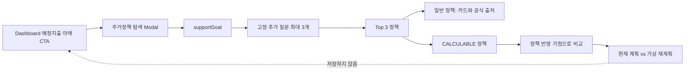

# 정책 반영 가상 재계획 P0 설계

기준일: 2026-08-31
상태: 팀 합의 설계 — OpenAPI·SQL·구현 전

이 문서는 `docs/기획서.md`의 정책 효과 what-if P1 문구와 `docs/미확정-설계.md`의
`INFORMATIONAL` 전용 P0 문구를 대체하는 신규 P0 설계다. 검토가 끝나면 두 문서를 같은 작업에서
정합화하고 OpenAPI·SQL·평가 계약을 작성한다.

## 1. 목표와 범위

20~30개 승인 정책은 모두 `supportGoal`·일회성 조건·KURE 검색으로 Top 3 후보가 된다. 이 중
사람이 원문과 수식·단위를 검수한 2~3개만 `CALCULABLE`로 표시하고, 사용자가 선택하면
**현재 계획과 정책 반영 가정 계획을 비교하는 일회성 가상 재계획**을 제공한다.

일반 정책은 카드·공식 출처·사전 작성한 `내 계획과의 연결`만 제공한다. `CALCULABLE`이 아닌
정책에 금액, 목표 시점, 절감률을 추정하거나 계산 CTA를 노출하지 않는다.

P0 가상 재계획은 결과를 저장하지 않고 `PlanVersion`, ACTIVE 계획, 거래, 예정지출, 재계획 이벤트를
변경하지 않는다. 정책 실제 승인·수령 후의 저장과 ACTIVE 변경은 P1이다.

## 2. 제품 흐름



`CALCULABLE` CTA는 상세 Modal 안에서만 노출한다. 결과 화면에는 다음 전제를 고정 표시한다.

> 이 비교는 정책 지원이 안내된 조건으로 확정된다는 가정의 시나리오입니다. 실제 지원 여부와
> 금액은 신청기관 심사로 확정되며 현재 계획에는 반영되지 않습니다.

## 3. 계산 경계

정책마다 자격·가구 범위·소득·자산·지역·대상 주택 규칙이 다르므로 하나의 자격 공식은 만들지
않는다. P0는 정책별로 이미 승인된 자격 결과를 사용하고, 지원 효과만 아래 두 공통 형태로
변환한다.

```text
ONE_TIME_FUNDING(amount, appliedMonth)
MONTHLY_EXPENSE_REDUCTION(amount, startMonth, endMonth)
```

- `ONE_TIME_FUNDING`: 정액 이사비·계약비 등 한 번의 명시적 지원. 적용 월에 목표 잔액을 줄이는
  **가정**으로 계산한다.
- `MONTHLY_EXPENSE_REDUCTION`: 정액 월세·거주비 지원. 지정 기간의 월 지출을 줄이는 **가정**으로
  계산한다.
- 이자율, 대출 한도, 보증 한도, 주택 매매가격 비율, 복수 우대금리, 부모·원가구 소득·자산 산정은
  P0 계산 대상이 아니다. 해당 정책은 `INFORMATIONAL` 또는 `ELIGIBILITY_ONLY`다.

정책별 adapter는 승인 metadata의 금액·기간·적용 조건을 검증해 하나의 adjustment만 반환한다.
LLM은 금액·기간·수식을 만들거나 사용자 금융 데이터를 받지 않는다.

## 4. 책임 분리

| 구성요소 | 책임 | 금지 |
|---|---|---|
| React | Modal 단계·응답 표시·가상 비교 요청 | 금액 계산, 온통청년 DTO 사용, 시나리오 저장 |
| Spring Core | 정책 검색·자격 상태·`CALCULABLE` gate·정책 효과를 adjustment로 변환 | 외부 LLM에 개인 데이터 전송, ACTIVE 변경 |
| FastAPI | 기존 결정론적 계획/몬테카를로에 adjustment를 적용해 비교값 산출 | DB 연결, 정책 원문 해석, 자격 판정 |
| 오프라인 정책 배치 | 공개 원문 수집·후보 추출·사람 승인·embedding artifact | DB 직접 연결, 사용자 데이터 처리 |

Spring만 PostgreSQL을 읽고 쓴다. FastAPI는 Spring이 전달한 최소한의 숫자 adjustment와 기존 계획
snapshot만 받는다.

## 5. 최소 계약 모델

이름은 OpenAPI 단계에서 확정하지만, P0 의미는 다음으로 고정한다.

```text
PolicyCalculationMode = INFORMATIONAL | ELIGIBILITY_ONLY |
                        ONE_TIME_FUNDING | MONTHLY_EXPENSE_REDUCTION

PolicyScenarioRequest
  - policyVersionId
  - currentPlanVersionId
  - supportGoal
  - answers

FutureCashflowAdjustment
  - type
  - amountWon             // 원 단위 정수
  - startYearMonth
  - endYearMonth?         // monthly reduction만 사용
  - sourceVersion

PolicyScenarioResponse
  - currentPlanSummary
  - assumedPlanSummary
  - assumptionNotice
  - sourceUrl, sourceVersion, lastVerifiedAt
```

`answers`는 정책 탐색과 같은 요청 범위 데이터다. 저장·일반 hash·HMAC·분석 로그에 남기지 않는다.
`policyVersionId`와 `currentPlanVersionId`는 현재 로그인 사용자가 볼 수 있는 리소스인지 Spring에서
검사한다.

## 6. 시나리오 계산 절차

1. Spring이 승인·유효 정책인지, 현재 사용자 소유 계획인지 확인한다.
2. 정책의 `calculationMode`가 두 P0 mode 중 하나인지 확인한다. 아니면 계산 요청을 거부하고
   일반 상세만 반환한다.
3. 정책별 승인 adapter가 `FutureCashflowAdjustment` 하나를 만든다. 금액·기간·source version이 없거나
   범위를 벗어나면 계산하지 않는다.
4. Spring이 기존 계획 입력 snapshot과 adjustment를 FastAPI에 보낸다.
5. FastAPI가 기존 엔진과 같은 seed·검증 규칙으로 `현재 계획`과 `가정 계획`을 계산한다.
6. Spring은 비교 결과와 가정 문구를 반환한다. React는 월 저축액, 목표 시점, 시뮬레이션 충족률을
   나란히 표시한다.
7. 응답은 화면 메모리에만 존재한다. Modal 종료·새로고침·로그아웃 뒤 폐기한다.

## 7. 선정과 데모

계산 가능 정책은 다음 모두를 만족해야 한다.

1. 공식 원문에 지원 금액과 적용 기간이 명시돼 있다.
2. P0 두 adjustment 형태 중 정확히 하나로 표현된다.
3. 추가 개인 심사 데이터 없이도 지원 효과의 입력값이 확정된다.
4. 사람이 원문 locator·금액 단위·기간·적용 월을 대조했고 golden scenario를 작성했다.
5. 정책 원문 변경·만료 시 `CALCULABLE`을 즉시 해제할 수 있다.

데모는 계산 가능 정책마다 seed 사용자와 기대 비교 결과를 하나씩 둔다. 데모 시작 화면에
`추천 시나리오`를 제공하되, 다른 20~30개 정책 탐색을 막지 않는다.

## 8. 실패 처리와 안전장치

| 상황 | 동작 |
|---|---|
| 일반 정책 선택 | 계산 CTA 없음, 카드·공식 출처 유지 |
| 자격 미확인·원문 누락 | 계산하지 않고 `추가 확인 필요` 표시 |
| adapter 검증 실패 | 가상 재계획 미표시, 기존 카드 유지 |
| FastAPI 계산 실패 | `정책 반영 비교를 만들지 못했습니다.`와 재시도, 기존 계획 유지 |
| 정책 검색 실패 | 기존 대시보드와 재계획 경로는 정상 유지 |
| 결과 수치 불일치 | 결과 폐기, fallback 카드만 표시 |

ACTIVE 계획 자동 변경, 정책 지원금의 실제 자산 반영, 정책 선택만으로 재계획 이벤트 생성은 모두
P0에서 금지한다.

## 9. 평가와 완료 조건

- 20~30개 정책 검색에서 Top 3·공식 출처·`NEEDS_CONFIRMATION`이 기존 기준을 지킨다.
- 계산 가능 정책 2~3개는 원문 기반 golden scenario에서 adjustment·월별 cashflow·현재/가정 계획
  차이가 결정론적으로 재현된다.
- `INFORMATIONAL`/`ELIGIBILITY_ONLY` 정책에 계산 CTA가 노출된 사례는 0건이다.
- 가상 결과 요청 전후 `PlanVersion`, ACTIVE 계획, 거래, 예정지출, 재계획 이벤트 row 변화는 0건이다.
- 실제 PostgreSQL과 Spring→FastAPI 경로, route interception 없는 브라우저 Modal 흐름으로 검증한다.

## 10. 구현 전 확정 게이트

구현은 아래 네 항목을 하나의 OpenAPI·SQL·eval 작업으로 고정한 뒤 시작한다.

1. 계산 가능 정책 2~3개의 공식 URL·version·원문 locator·금액·기간·적용 월
2. 각 정책의 `calculationMode`와 golden demo 사용자·기대 비교 결과
3. adjustment를 받을 FastAPI 내부 계약과 정수·날짜·누락값 경계
4. Policy Scenario Public API의 endpoint·request/response·오류 상태

이 네 항목 중 하나라도 검증되지 않은 정책은 `CALCULABLE`이 아니라 일반 정책으로 적재한다.
