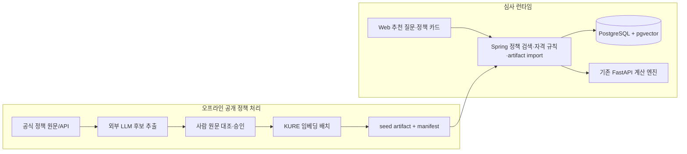

# 내집마련 Odyssey — 제품·구현 통합기획 v4.0

기준일: 2026-08-30

목적: 2026 금융 AI Challenge URL 제출용 MVP와 제출 이후 확장 방향의 단일 제품 기준

상태: 제품 방향 확정안 + 계약 변경 전 설계안

- 본선 제출: 2026-09-07 10:00까지 기획서 PDF, 기능명세서 PDF, 웹서비스 URL
- 심사 URL 운영: 2026-09-07 11:00~2026-09-11 23:59
- 발표 심사 진출 시: 최종 발표자료와 소스코드 제출

> 이 문서의 5-4, 5-5, 5-6 절은 기존 코드 주석이 참조한다. 번호를 바꾸지 않는다.
> DB·API·새 인프라·계산 계약은 이 문서만으로 확정하지 않는다. `docs/미확정-설계.md`의
> 결정 게이트를 통과한 뒤 OpenAPI·SQL·코드·테스트를 같은 작업에서 변경한다.
>
> **DB 접근 원칙:** PostgreSQL의 읽기·쓰기와 pgvector 검색은 Spring Core만 수행한다.
> Python/FastAPI와 KURE 오프라인 배치는 DB 자격증명이나 직접 연결을 가지지 않고, 검증 가능한
> seed artifact만 만든다. Spring이 artifact를 검증·적재한다.

## 0. 상태 표기와 이번 결정

- **[확정]**: 기존 코드와 제품 불변조건을 유지하며 MVP 기준으로 채택
- **[설계안]**: 권장 구조이지만 DB/API 승인 전
- **[TBD]**: 실데이터·벤치마크·정책 원문을 확인한 뒤 결정
- **[P1]**: 핵심 사용자 흐름이 끝난 뒤 제출 전 여유가 있을 때
- **[P2]**: 제출 또는 본선 이후
- **[제외]**: MVP에서 의도적으로 제외

이번 버전의 핵심 결정은 다음과 같다.

1. 제품 축은 **2030 청년의 내집마련 목표를 위한 동적 저축 계획과 주거정책 탐색**으로 좁힌다.
2. 금액·절감률·도달 시점·시뮬레이션 충족률은 기존 결정론적 엔진과 몬테카를로만 산출한다.
3. KURE 임베딩은 주거정책 문서 검색에 사용하고 신청 자격이나 정책 효과를 판정하지 않는다.
4. 외부 클라우드 LLM은 공개 정책 문서의 오프라인 메타데이터 초안 생성에만 사용한다.
5. Qwen sLLM은 심사 핵심 경로에서 제외한다. 계획 설명은 검증된 값으로 구성하는 템플릿이
   기본이며, sLLM은 운영 벤치가 통과할 때만 선택 기능으로 남긴다.
6. 국토교통부 실거래 기반 목표주택 가격 자동 산출, 주담대 정책 효과 계산, 자유대화 Agent는
   전체 제품 방향에는 포함하되 9월 7일 MVP에는 별도 게이트를 둔다.
7. P0는 대표 질문의 사전 생성 embedding만 사용한다. 런타임 KURE와 자유입력 semantic search는
   P1 검토 항목이며, 도입하더라도 Spring만 DB를 조회한다.

---

## 1. 주제

### 1-1. 한 줄 정의

**내집마련 Odyssey는 청년이 내집마련 목표와 현재 재무상태를 입력하면 70/80/90 실행계획을
계산하고, 공식 주거정책 문서에서 자신의 상황과 관련된 정책을 근거와 함께 찾아주며, 실제
소비 변화에 따라 계획을 다시 제안하는 AI 금융 서비스다.**

### 1-2. 사용자에게 주는 결과

- 목표일까지 필요한 저축액과 매월 사용 가능한 금액
- 소비 여유형 70%, 균형형 80%, 목표 우선형 90% 계획 비교
- 과거의 나만을 기준으로 한 미래 지출 변동 범위와 시뮬레이션 충족률
- 계획에서 벗어났을 때 기존 계획을 덮어쓰지 않는 재계획 제안
- 나이·지역·혼인·주택 보유 등 확인된 조건과 자연어 의도에 맞는 주거정책 카드
- 각 정책의 공식 출처, 기준일, 일치 조건, 추가 확인이 필요한 조건

### 1-3. AI의 제품적 역할

AI는 장식이나 설명문 생성 개수로 평가하지 않는다. KURE 임베딩이 없을 때보다 관련 정책을
더 잘 찾는지, 사용자가 여러 공공 사이트를 탐색하지 않고 자신의 다음 행동을 정할 수 있는지로
평가한다.

- **KURE 임베딩**: 정책 원문과 대표 질문의 의미 유사도 검색
- **외부 LLM**: 공개 원문의 태그·요약·규칙 후보를 만드는 오프라인 보조자
- **결정론적 시스템**: 자격 조건의 확정 판정, 금액 계산, 계획 버전과 사용자 승인
- **템플릿 설명**: 확정 숫자와 검색 근거를 변형하지 않고 사용자 문장으로 조립
- **sLLM 선택 기능**: 개인 금융 요약을 외부로 보내지 않고 부가 설명할 수 있으나 핵심 경로를
  차단하지 않음

### 1-4. 대회 적합성과 차별점

2026 대회는 아이디어만이 아니라 실제 동작하는 AI 금융 웹서비스/MVP를 요구한다. 이전
수상작은 분산된 금융·정책 정보를 종합해 개인별 행동으로 연결했다. Odyssey의 차별점은
다음 연결에 있다.

`개인 소비 변동 → 검증 가능한 저축 계획 → 관련 주거정책 근거 → 사용자 승인형 재계획`

AI를 제거하면 정책 검색 품질이 떨어지지만, AI가 실패해도 계산과 계획은 망가지지 않는다는
구조가 금융 서비스 관점의 핵심이다.

---

## 2. 페인포인트

- 청년은 목표주택, 현재 자금, 월소득·지출, 대출 가정, 주거정책을 서로 다른 사이트와
  계산기에서 확인해야 한다.
- 기존 가계부는 과거 소비를 보여주지만 목표일까지 얼마를 줄여야 하는지와 달성 가능성을
  지속적으로 갱신하지 못한다.
- 정책 검색은 사용자가 정확한 정책명을 알아야 하고, 비슷한 정책 사이에서 자신에게 관련된
  정책을 가려내기 어렵다.
- 의미상 관련된 정책과 실제 신청 가능한 정책이 혼동되기 쉽다.
- 개인 금융 데이터를 외부 LLM API로 보내면 개인정보·로그·보존·국외 이전 위험이 생긴다.
- 작은 자체호스팅 LLM은 CPU 환경에서 지연과 실패율이 높아 심사 핵심 흐름을 불안정하게 만들 수
  있다.

### 2-1. 해결 원칙

- 사용자가 반드시 알아야 하는 숫자는 공식 데이터와 결정론적 코드로 재현한다.
- 정책 검색은 `구조화 조건 필터 + 의미 유사도 순위화`로 나눈다.
- `관련 정책`, `조건상 후보`, `추가 확인 필요`, `조건 불충족`을 서로 다른 상태로 표시한다.
- 정책 카드에는 공식 출처와 기준일을 항상 노출한다.
- 정책 검색·외부 API·LLM 장애는 기존 계획 생성과 대시보드를 실패시키지 않는다.

---

## 3. 기대효과와 성공 기준

### 3-1. 사용자 효과

- 막연한 절약 목표를 월별 실행 계획으로 바꾼다.
- 사용자의 과거 소비 변동을 반영해 단일 숫자 대신 시뮬레이션 범위를 제공한다.
- 여러 주거정책 중 현재 상황과 목표에 가까운 정책을 빠르게 찾는다.
- 상황이 바뀌면 새 계획을 제안하되 사용자의 ACTIVE 계획은 명시적 승인 전 바뀌지 않는다.

### 3-2. MVP 성공 기준

1. 인증 또는 데모 진입부터 계획 선택, 대시보드, 정책 카드까지 한 브라우저 흐름으로 동작한다.
2. 계획 숫자는 동일 입력·seed에서 동일하고 LLM·검색 장애와 무관하다.
3. 2030 주거정책 소규모 코퍼스와 대표 질문 30개에서 `Recall@3 >= 0.85`, `MRR >= 0.70`을
   목표로 한다. 표본이 작으므로 절대 성능 주장이 아니라 MVP 회귀 기준으로 사용한다.
4. 신청 불가 조건을 `조건상 후보`로 확정 표시하는 테스트 오류는 0건이어야 한다.
5. 모든 정책 카드가 `sourceUrl`, `sourceContentHash`, `sourceVersion`, `lastVerifiedAt`을 각각 가진다.
6. 외부 LLM 요청에 사용자 식별자·거래·목표금액·저축액·소득·지출이 포함된 건은 0건이어야
   한다.

---

## 4. 필요 데이터 리스트

### 4-1. 개인 금융 데이터 [확정]

- 사용자 생년월일·거주지역
- 월소득·월고정비
- 현재 모은 금액과 목표 금액·목표일
- 거래와 환불, 예정지출
- 계획 버전, 선택한 계획, 재계획 이벤트

비교 대상은 사용자 본인의 과거뿐이다. 또래 평균이나 타인과의 순위를 만들지 않는다.

### 4-2. 소비 변동 데이터 [확정]

IBM TabFormer 기반 24개월 오프라인 거래 템플릿을 사용한다. 외부 데이터의 금액을 한국인의
대표 금액으로 해석하지 않고 소비 카테고리와 시계열 변동 형태만 사용한다. 금액은 데모 seed
생성 규칙에 따라 원화로 변환하고 원본 hash와 transform 버전을 기록한다.

### 4-3. 주거정책 코퍼스 [설계안]

- 대상: 만 19~39세 중심의 주택 구입·전세·주거비·신혼부부 관련 공공정책
- 규모: MVP 정책 20~30개, 문서 청크 100~300개
- 소스: 정부·공공기관의 공식 정책 페이지 또는 공식 오픈 API
- 갱신: 제출 전 승인된 snapshot을 고정하고 심사 운영 기간에는 자동 갱신하지 않는다.
- 수집 상태: `DISCOVERED`, `NORMALIZED`
- 검토 상태: `CANDIDATE`, `APPROVED`, `REJECTED`
- 정책 lifecycle: `ACTIVE`, `RETIRED`; 기준일 만료 여부는 version의 `validFrom/validTo`로 계산
- 사용자 매칭 상태: `RELATED`, `POTENTIALLY_ELIGIBLE`, `NEEDS_CONFIRMATION`, `INELIGIBLE`,
  `EXPIRED`

정확한 원천 API와 실제 정책 목록은 `docs/미확정-설계.md`에서 결정한다.

### 4-4. 정책 메타데이터 [설계안]

- 대상: `YOUTH`, `NEWLYWED`, `FIRST_TIME_BUYER`
- 목적: `PURCHASE`, `JEONSE`, `RENT`
- 지원: `MORTGAGE`, `GUARANTEE`, `INTEREST_SUPPORT`, `GRANT`, `INFORMATION`
- 지역: 전국/시도/시군구와 공식 지역 코드
- 조건: 나이, 혼인 상태·기간, 자녀, 무주택, 생애최초, 개인/부부/가구 소득 기준
- 기간: 신청 시작·종료, 상시 여부, 마지막 검증 시각
- 근거: `sourceUrl`, `sourceContentHash`, `sourceVersion`, `lastVerifiedAt`, 원문 내 근거 구간
- 판정 가능성: `CALCULABLE`, `ELIGIBILITY_ONLY`, `INFORMATIONAL`

LLM이 만든 값은 `CANDIDATE`이며 사람이 원문과 대조해 `APPROVED`로 바꾸기 전에는 사용자에게
확정 조건으로 노출하지 않는다.

### 4-5. 실거래와 목표주택 데이터 [P1/TBD]

국토교통부 실거래 데이터를 이용한 기준가격은 전체 제품 방향에 포함한다. 다만 아파트 매매,
면적 band, 최근 N개월, sparse 거래 기준, 지역 코드 매핑이 확정되기 전에는 MVP 계산 입력으로
연결하지 않는다. P0에서는 사용자가 목표금액을 직접 입력하는 기존 계약을 유지한다.

### 4-6. 데이터 민감도 경계 [확정]

| 데이터 | Core/PostgreSQL | KURE 오프라인 | 외부 LLM |
|---|---|---|---|
| 공개 정책 원문·URL | 허용 | 허용 | 허용 |
| 비민감 정책 태그·요약 후보 | 허용 | 허용 | 허용 |
| 익명 대표 질문 | 허용 | 허용 | 허용 가능 |
| 사용자 ID·이메일 | 허용 | 금지 | 금지 |
| 거래·목표금액·저축액·소득·지출 | 허용 | 금지 | 금지 |
| 개인별 정책 조건 | 최소 저장 | 원문 임베딩에 혼합 금지 | 금지 |

KURE 배치는 공개 정책 원문과 익명 대표 질문만 받아 `seed artifact`와 manifest를 만든다. artifact에는
원문 hash, chunk 순서, KURE model revision, dimension(1024), 생성 시각을 포함한다. DB 연결 문자열,
사용자 조건, 금융 데이터는 배치 환경변수와 입력 DTO에 존재하지 않아야 한다. Spring import만 이
artifact를 검증한 뒤 정책 snapshot을 원자적으로 적재한다.



---

## 5. 컴포넌트별 역할 및 요구 기능

### 5-0. 설계 원칙 — 숫자·검색·설명 책임 분리

- 금액·절감률·도달 시점·시뮬레이션 충족률은 결정론적 엔진과 몬테카를로에서만 나온다.
- 임베딩 유사도는 관련성 순위를 만들 뿐 신청 자격을 확정하지 않는다.
- 정책 자격은 승인된 구조화 규칙과 사용자 입력으로만 판정한다.
- 정책 효과 금액은 사람이 승인한 `CALCULABLE` 규칙만 결정론적으로 계산한다.
- LLM은 확정 JSON과 승인된 정책 원문을 설명할 수 있지만 새로운 숫자와 조건을 만들지 않는다.
- 사용자의 ACTIVE 계획은 AI·시장·정책 변화로 자동 변경되지 않는다.

### 5-1. 지출 카테고리와 계획 입력 [확정]

고정비, 유동지출, 예정지출을 분리한다. 유동지출만 절감과 부트스트랩 대상이다. 원본 PAYMENT와
REFUND는 보존하고 정확한 외부 식별자로 연결된 환불만 과거 소비에서 조정한다.

P0 내집마련 목표는 기존 `financial_goals` 계약을 재사용한다.

- `targetAmount`: 목표일까지 확보하려는 자기자본 또는 사용자가 정한 내집마련 자금
- `currentSavedAmount`: 현재 실제로 사용할 수 있는 구매자금
- `targetDate`: 목표 매수 시점

가족지원금, 주담대 가정, 실거래 기준가격을 별도 입력으로 추가하는 것은 P1 계약 변경이다.

### 5-2. 정책 수집·승인·검색 [설계안]

#### 오프라인 수집

```text
공식 원문/API
  → 원문 정규화·hash
  → 외부 LLM 메타데이터/규칙 후보 생성
  → JSON Schema 검증
  → 사람의 원문 대조와 APPROVED 전환
  → 정책 청크·대표 질문을 KURE로 임베딩
  → pgvector seed artifact + manifest 생성
  → Spring import의 hash·revision·1024차원 검증
  → Spring transaction으로 PostgreSQL/pgvector snapshot 적재
```

#### 런타임 검색

```text
사용자 확인 조건 + 선택한 질문/의도
  → hard metadata filter
  → 승인된 대표 질문 embedding 또는 query embedding 선택
  → pgvector cosine Top-K
  → 만료·중복·근거 없는 후보 제거
  → 승인 규칙으로 eligibility state 판정
  → 출처가 포함된 정책 카드
```

P0는 KURE를 런타임에 상주시키지 않는다. 심사 시나리오는 사전 임베딩한 대표 질문과 구조화
입력으로 한정한다. 자유입력은 `UNSUPPORTED_INTENT`와 지원 질문 목록을 반환한다. P1에서
자유입력 semantic search가 필요하면 Spring 내 ONNX KURE 또는 DB 없는 embedding service를
벤치마크한 뒤 선택하되, embedding 결과의 DB 검색·저장은 계속 Spring만 담당한다.

### 5-3. 전체 파이프라인

```text
[인증/데모 → 프로필·재무·목표 입력]
              ├─→ [기존 계산/몬테카를로] → [70/80/90 계획] → [PlanVersion]
              └─→ [정책 조건 + 질문 intent] → [metadata + vector 검색] → [정책 카드]

[거래·예정지출 변화] → [Replan Proposal] → [사용자 승인] → [새 ACTIVE PlanVersion]
```

정책 검색 실패는 왼쪽 계산 경로를 실패시키지 않는다. 정책 효과를 계획에 적용하는 P1에서도
원본 계획과 정책 적용 what-if를 별도 proposal로 비교한 뒤 승인한다.

### 5-4. 재무 계획 계산 엔진 — 규칙 기반 [확정]

```text
가용예산 A = (소득 - 고정비) × 개월수 - 예정지출 - 남은 목표저축액
강도별 절감률 r* = 1 - A / quantile(T, p)
```

- `T`는 같은 몬테카를로 경로에서 나온 총 유동지출 분포다.
- PRESET nominal level은 0.70, 0.80, 0.90이다.
- 같은 경로 집합을 사용해 강도 간 시뮬레이션 노이즈를 제거한다.
- 소득 0, 지출>소득, 잔여기간 1개월, 최대 절감으로도 목표 미달을 명시적으로 처리한다.
- 주택 가격이나 정책 효과를 LLM이 계산 입력으로 주입하지 않는다.

### 5-5. 몬테카를로 시뮬레이션 [확정]

- 사용자의 과거 완전월 유동지출을 IID 부트스트랩한다.
- seed가 있는 10,000개 경로를 NumPy 벡터 연산으로 생성한다.
- 예정지출은 확정 이벤트로 고정 차감한다.
- 10/25/50/75/90 percentile band를 fan chart에 사용한다.
- rolling-origin 백테스트와 coverage로 보정 상태를 검증한다.

이는 미래 집값·금리·소득을 예측하지 않는다. 사용자가 집값 상승률이나 대출액을 가정하는
what-if는 P1 결정론적 시나리오로 분리한다.

### 5-6. 동적 재계획 [확정]

월간, 사용자 수동 요청, 큰 단건 소비 shock, 월중 누적 drift, 예정지출 변경을 감지해 새
`PROPOSED` 계획을 만든다. 기존 ACTIVE 계획은 사용자가 제안을 승인하고 옵션을 선택하기 전까지
유지한다. 정책·시장 변화도 향후 같은 proposal/approval 경계를 사용한다.

### 5-7. 사용자 설명 — 템플릿 기본, sLLM 선택 [설계안]

P0 기본 설명은 서버가 검증된 필드만 조립한다.

- 계획: `목표일까지 남은 금액`, `월 사용 가능액`, `시뮬레이션 충족률`, `재계획 사유`
- 정책: `왜 관련 있는지`, `확인된 조건`, `추가 확인 조건`, `신청 기간`, `공식 출처`
- 숫자는 API의 원 단위 정수/비율을 formatter로 표시한다.

기존 Qwen 설명 파이프라인은 다음 조건에서만 선택적으로 켠다.

- 계획 생성과 정책 검색을 차단하지 않는 비동기 기능
- 개인 거래 원문이 아니라 최소 집계 JSON만 입력
- 출력 숫자 원본 대조와 최대 2회 교정
- timeout 또는 검증 실패 시 즉시 같은 의미의 템플릿
- staging에서 합격하기 전 UI가 `READY`를 전제로 하지 않음

### 5-8. 백엔드와 인프라 [설계안]

- **React**: 인증, 온보딩, 70/80/90 비교, dashboard, 정책 조건 확인, 정책 카드와 출처
- **Spring Core**: 인증·소유권·DB 읽기/쓰기·PlanVersion·정책 카탈로그·검색 조율·상태 전이.
  KURE artifact 검증과 pgvector seed import의 유일한 실행 주체다.
- **FastAPI**: 순수 계산과 몬테카를로. DB 연결·DB 자격증명·pgvector 접근 권한이 없다.
- **KURE 오프라인 배치**: 공개 정책과 익명 대표 질문의 embedding artifact만 생성한다. FastAPI
  런타임 이미지와 분리하고 PostgreSQL에 직접 연결하지 않는다.
- **PostgreSQL**: 기존 금융·계획 데이터 + 승인된 정책 카탈로그·버전·청크·검색 provenance
- **pgvector [TBD]**: 1024차원 KURE embedding 저장과 cosine 검색
- **Redis**: 기존 설명 작업에만 사용. 정책 검색 캐시를 넣으려면 실측과 별도 승인이 필요
- **외부 LLM**: 개발/운영자 배치에서 공개 정책 원문만 처리하며 사용자 요청 경로에 없음
- **Ollama/Qwen**: 심사 P0 기본 compose에서 제외하는 안을 우선 검토

심사 운영 기간에는 정책 동기화, 모델 교체, 인스턴스 변경, 부하 테스트를 하지 않는다.

### 5-9. MVP 화면과 심사 시나리오 [설계안]

1. 데모 사용자 선택 또는 로그인
2. 생년월일·지역·월소득·고정비·현재 자금·목표금액·목표일 입력
3. 70/80/90 계획 생성과 하나 선택
4. 정책 조건 중 혼인·자녀·무주택·생애최초·소득 기준 확인
5. 대표 질문 하나 선택 또는 허용된 범위에서 검색
6. Top 3 정책 카드에서 일치 조건·추가 확인·공식 출처 확인
7. 큰 소비 또는 예정지출 변경 후 재계획 proposal 비교
8. 사용자가 승인해야 새 계획 활성화

대표 질문은 20~40개를 준비한다. 최종 답변 전체를 캐시해 실시간 AI처럼 보이게 하지 않고,
질문 embedding·검색 기대값·정책 카드의 공개 요약만 캐시한다.

---

## 6. 컴포넌트별 평가 방법

| 대상 | 기준 |
|---|---|
| 계산 엔진 | 동일 입력·seed 동일 결과, 금액/경계값 유닛테스트 |
| 몬테카를로 | rolling-origin coverage, 분위수 단조성, 10,000 경로 |
| 정책 메타데이터 | 원문 대조 정확도, 필수 필드 누락, source hash 재현성 |
| 정책 검색 | metadata-only 대비 hybrid Recall@3/MRR, near-miss 질문 |
| KURE seed 경계 | artifact hash·revision·1024차원 불일치 거부, Spring 외 DB 연결 0건 |
| 자격 판정 | 불충분 정보는 `NEEDS_CONFIRMATION`, false eligibility 0건 |
| 외부 LLM 경계 | 금지 필드 전송 0건, schema 실패 후보 자동 미승인 |
| sLLM 선택 기능 | 숫자 변조 0건, timeout/fallback, core flow 불변 |
| E2E | 실제 HTTPS·PostgreSQL·Spring·FastAPI와 route interception 없는 브라우저. 기존 비동기 설명 계약을 유지하는 구성은 실제 Redis까지 포함하고, Redis 제거가 별도 승인되면 변경된 계약 기준으로 검증 |

정책 검색 평가 세트는 최소 30개 질문과 예상 Top 3 정책, 제외해야 할 유사 정책을 함께 가진다.
메타데이터-only를 기준선으로 두어 임베딩이 실제로 결과를 개선했는지 보여준다.

---

## 7. 리소스와 성능 결정

- 기존 Qwen Docker 30분 검증은 READY 25.1%, FALLBACK 74.9%, Ollama peak 약 3.3GiB였다.
  따라서 실시간 sLLM은 P0 배포 사양의 근거가 될 수 없다.
- 정책 문서와 대표 질문 임베딩은 GPU가 없어도 오프라인에서 생성하고 seed artifact로 배포한다.
- 런타임 KURE를 제외하면 임베딩 질의는 승인된 대표 질문에 한정된다.
- pgvector 검색은 작은 코퍼스에서 정확성 우선으로 설정하고 성능 최적화를 선행하지 않는다.
- 목표 지연시간 초안: 정책 검색 p95 1초 이내, 검색 장애 fallback p95 1초 이내. 실제 합격값은
  구현 후 staging에서 확정한다.
- 기본 배포 후보는 sLLM 없는 `t4g.medium` 또는 전체 서비스 메모리 실측을 통과한 사양이다.

### 7-1. 인력·공수 전제

개발자 2명이 모두 Codex를 코드 탐색·초안·테스트 골격·리뷰에 적극 활용한다. 이 효과는 공수
추정에 이미 포함하며 별도 생산성 배수를 다시 곱하지 않는다. P0 예상 공수는 8~12인일,
계약을 첫날 고정하고 독립 파일을 병렬 작업할 때 예상 달력 기간은 5~7일이다.

- A: 정책 데이터·KURE seed·PostgreSQL/pgvector·Core 검색
- B: Web 정책 카드·API 연결·데모·compose/HTTPS
- 공동: DB/API 결정, 실제 DB smoke, 개인정보 경계, 배포 리허설

세부 작업과 산정 근거는 `docs/MVP-공수-검증-계획.md`를 따른다.

### 7-2. MVP 검증 절충

MVP에서는 전체 API·DB 경계 조합, 부하·soak·stress, 전 브라우저 조합을 뒤로 미룰 수 있다.
그러나 실제 PostgreSQL migration/vector query smoke, 계산 표적 회귀, 외부 LLM 개인정보 경계,
정책 장애 fallback, 실제 HTTPS 핵심 브라우저 흐름은 생략하지 않는다. 미실행 항목은 합격이 아니라
`DEFERRED_MVP`로 기록한다.

기능 안정화 후 staging에서 첫 전체 부하·성능 측정을 `baseline-001`로 고정하고, 이후 같은 환경·
데이터·부하 조건에서 개선 전후 수치와 commit을 누적 기록한다.

---

## 8. 남은 운영 결정

상세 선택지·권장안·영향 경로는 `docs/미확정-설계.md`에서 관리한다.

1. 9월 7일 MVP에서 목표주택 실거래 기준가격을 포함할지
2. 정책 원천 API와 실제 승인 정책 20~30개
3. pgvector 도입과 PostgreSQL 이미지·migration 방식
4. P1 자유입력에서 Spring 내 ONNX KURE와 DB 없는 embedding service 중 무엇을 사용할지
5. 혼인·자녀·무주택·생애최초·가구소득의 저장 범위
6. 정책 효과를 정보 제공에 한정할지, 승인된 what-if까지 포함할지
7. 기존 sLLM API/DB 상태를 유지한 채 기본 비활성화할지 제거할지
8. 외부 LLM 공급자·모델·로그 보존·비용 상한

---

## 9. AI 방법론 선택 근거

| 방법 | MVP 판단 | 이유 |
|---|---|---|
| KURE 한국어 embedding | 채택 | 한국어 정책 원문과 사용자 의도 의미 검색 |
| metadata/rule engine | 채택 | 자격·만료·지역 같은 hard constraint 보장 |
| 외부 LLM metadata extraction | 오프라인 채택 | 공개 문서 구조화 비용 절감, 사람 승인 전제 |
| Qwen sLLM | 선택/비핵심 | 개인정보 외부 전송 방지 장점은 있으나 현재 안정성 낮음 |
| 결정론적 금융 계산 | 채택 | 숫자 재현성과 감사 가능성 |
| IID Monte Carlo | 채택 | 개인 소비 변동에 따른 시뮬레이션 충족률 |
| 미래 집값·금리 예측 ML | 제외 | 데이터·검증·설명 책임이 MVP 범위를 초과 |
| 자유도 높은 Agent loop | 제외 | 개인정보·비용·지연·오작동 위험이 큼 |

생성형 AI가 대회 참가의 형식적 필수조건이기 때문에 sLLM을 유지하는 것이 아니다. 검색·구조화
AI가 사용자 결과를 실제로 개선하고, 그 개선을 검색 평가로 입증하는 것이 더 중요하다.

---

## 10. 이전 수상작에서 가져온 제품 원칙

2025 대상작 SIGNAL은 매출·리뷰·정책처럼 흩어진 데이터를 종합해 소상공인의 위기 신호와
행동 방안을 제시했다. 다른 수상작은 임신 시기·지역에 따라 정부 정책과 금융상품을 개인화했다.
공통점은 특정 모델 보유가 아니라 **분산 정보 → 개인 상황 해석 → 행동 가능한 결과**의 연결이다.

Odyssey는 이 패턴을 다음과 같이 적용한다.

- 분산 정보: 개인 소비 이력, 목표, 공식 주거정책
- 해석: 몬테카를로와 metadata+KURE hybrid retrieval
- 행동: 70/80/90 계획 선택, 정책 신청 확인, 사용자 승인형 재계획
- 신뢰: 원문 출처, PlanVersion snapshot, AI 실패와 계산 실패의 분리

공식 근거:

- 2026 금융 AI Challenge: <https://daker.ai/public/hackathons/2026-finance-ai-challenge>
- 금융보안원 2025 수상작 발표: <https://www.fsec.or.kr/bbs/detail?bbsNo=11812&menuNo=69>
- 금융보안원 2026 대회 안내: <https://www.fsec.or.kr/bbs/detail?bbsNo=11995&menuNo=69>
- KURE-v1 모델 카드: <https://huggingface.co/nlpai-lab/KURE-v1>

---

## 11. 문서 간 우선순위

1. 불변조건과 승인 경계: 루트 `AGENTS.md`
2. 제품 목표와 범위: 이 문서
3. 목표 아키텍처: `docs/정책-RAG-아키텍처.md`
4. 현행 코드 변경 지도: `docs/현행-변경영향분석.md`
5. 아직 확정하지 않은 선택: `docs/미확정-설계.md`
6. 실제 계약: `API/openapi-*.yaml`, `sql/*.sql`
7. 구현과 테스트

문서가 충돌하면 하위 문서를 임의로 해석하지 않고 `docs/미확정-설계.md`에 올린다.
