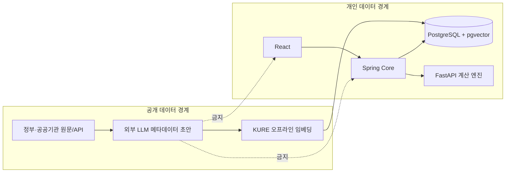

# Odyssey 정책 RAG 아키텍처 설계

기준일: 2026-08-30
상태: DB/API 승인 전 목표 설계
범위: 2030 청년의 주거·내집마련 정책 탐색

## 1. 설계 결론

MVP는 **승인된 정책 메타데이터로 후보를 좁히고 KURE 임베딩으로 관련성을 순위화하는
hybrid retrieval**을 사용한다. 임베딩은 신청 자격이나 금액을 판정하지 않는다. 외부 LLM은
공개 정책 원문을 오프라인에서 구조화하는 데만 쓰며 사용자 요청 경로와 분리한다.

- 정책·대표 질문 embedding: 개발자 배치에서 생성
- 저장: PostgreSQL + pgvector, 1024차원
- 런타임: Spring이 metadata filter와 vector 검색을 조율
- 계산: 기존 FastAPI 결정론적 엔진과 분리
- 설명: 검증된 metadata와 원문 근거를 템플릿으로 조립
- KURE 서버: 대표 질문 방식이면 불필요, 자유입력 지원 시에만 별도 검토
- sLLM: 정책 검색 경로에 사용하지 않음

## 2. 신뢰 경계



외부 LLM으로 전송 가능한 데이터는 정책 원문, 원문 URL, 공개 기관명, 정책 ID, 비민감
분류 체계뿐이다. 사용자 식별자, 개인 조건, 금융 데이터는 전송하지 않는다.

## 3. 오프라인 정책 수집 파이프라인

1. 공식 URL/API에서 원문을 가져온다.
2. HTML·첨부문서에서 본문과 표를 정규화하고 원문 hash를 계산한다.
3. 외부 LLM에 고정 JSON Schema로 metadata와 eligibility rule 후보를 요청한다.
4. enum·날짜·금액 단위·근거 구간을 기계 검증한다.
5. 관리자가 원문과 비교해 `APPROVED` 또는 `REJECTED`를 결정한다.
6. 승인 원문을 정책 단위와 의미 단위 청크로 나눈다.
7. 정책 청크와 대표 질문을 같은 KURE 모델·버전으로 임베딩한다.
8. manifest, 원문 hash, 모델 버전, 차원, 생성 시각을 seed artifact에 기록한다.
9. 실제 PostgreSQL에 적재하고 검색 평가를 통과한 snapshot만 배포한다.

외부 LLM 출력은 다음과 같은 후보 JSON이다. `UNKNOWN` 문자열을 여러 타입에 섞지 않는다.
모든 추출 필드는 `{ value, evidence }` 형태로 받고, 근거가 없으면 `value: null`,
`evidence: []`, `reviewState: "UNKNOWN"`으로 고정한다. 값이 있는데 근거가 없거나 locator의
quote hash가 원문과 맞지 않으면 JSON Schema 통과 여부와 무관하게 후보 전체를 자동 반려한다.

```json
{
  "policyId": "source-stable-id",
  "title": {
    "value": "정책명",
    "evidence": [{ "quoteHash": "sha256", "locator": "title" }],
    "reviewState": "CANDIDATE"
  },
  "audiences": {
    "value": ["YOUTH", "NEWLYWED"],
    "evidence": [{ "quoteHash": "sha256", "locator": "section-3" }],
    "reviewState": "CANDIDATE"
  },
  "housingGoals": {
    "value": ["PURCHASE"],
    "evidence": [{ "quoteHash": "sha256", "locator": "section-4" }],
    "reviewState": "CANDIDATE"
  },
  "supportTypes": { "value": null, "evidence": [], "reviewState": "UNKNOWN" },
  "regions": {
    "value": ["NATIONWIDE"],
    "evidence": [{ "quoteHash": "sha256", "locator": "section-2" }],
    "reviewState": "CANDIDATE"
  },
  "applicationPeriod": {
    "value": { "kind": "CONTINUOUS", "from": null, "to": null },
    "evidence": [{ "quoteHash": "sha256", "locator": "section-5" }],
    "reviewState": "CANDIDATE"
  },
  "eligibilityCandidate": { "value": null, "evidence": [], "reviewState": "UNKNOWN" },
  "summaryCandidate": {
    "value": "공개 원문 기반 요약",
    "evidence": [{ "quoteHash": "sha256", "locator": "section-1" }],
    "reviewState": "CANDIDATE"
  }
}
```

고정 schema는 필드별 nullable 여부, enum, evidence 최소 개수와 `additionalProperties: false`를
강제한다. 다만 schema는 형식만 검증한다. 의미가 원문과 일치하는지는 관리자 승인 단계에서
확정하며, 승인 전 후보는 검색 index에 들어가지 않는다.

## 4. 논리 데이터 모델

실제 테이블명과 제약은 승인 후 SQL에서 확정한다.

| 엔터티 | 핵심 필드 | 역할 |
|---|---|---|
| `policy_sources` | sourceUrl, provider, sourceVersion, fetchedAt, sourceContentHash | 원문 provenance |
| `policies` | canonical ID, title, lifecycleStatus | 중복 소스를 합친 정책 정체성 |
| `policy_versions` | policyId, sourceId, version, validFrom/To, reviewStatus, approvedAt, lastVerifiedAt | 변경·만료·검증 이력 |
| `policy_metadata` | versionId, audience, goal, support, region, conditions, displayPriority | 버전별 hard filter·fallback 입력 |
| `policy_chunks` | versionId, text, locator, embedding | 근거 검색 단위 |
| `policy_rule_versions` | condition AST, status, reviewer | 승인된 자격 규칙 |
| `policy_query_profiles` | intent ID, question, tags, embedding | 대표 질문 캐시 |
| `policy_index_snapshots` | snapshot ID, manifest hash, status, activatedAt | 원자적 index 배포 단위 |
| `policy_snapshot_versions` | snapshotId, versionId | snapshot에 포함된 승인 버전 집합 |
| `policy_retrieval_runs` | random run ID, intent/version, index version, result IDs | 비민감 검색 재현·평가 |

`policies.lifecycleStatus`는 정책 정체성의 `ACTIVE/RETIRED`만 나타낸다.
`policy_versions.reviewStatus`는 `CANDIDATE/APPROVED/REJECTED`이고 검색 승인 여부를 소유한다.
유효기간 만료는 저장 상태를 덮어쓰지 않고 `validFrom/validTo`와 조회 기준일로 계산한다.
`sourceVersion`은 공급자 값 유무와 관계없이 수집기가 원문 변경마다 부여하는 source 내 단조 증가
버전이고, `lastVerifiedAt`은 관리자가 해당 policy version을 마지막으로 원문 대조한 시각이다.
`displayPriority`는 승인 시 정하는 제한된 정수이며 동률 순서를 위한 것일 뿐 자격 점수가 아니다.
`sourceUrl`, `sourceContentHash`, `sourceVersion`, `lastVerifiedAt`은 version에서 source를 따라 반드시
복원할 수 있어야 하며 정책 카드 응답에서는 모두 required다. 여러 원천을 병합한 경우 카드에는
판정에 사용한 모든 source를 배열로 반환하고 임의의 대표 URL 하나로 축약하지 않는다.

개인 조건 원문이나 그 hash/HMAC은 retrieval run에 저장하지 않는다. 작은 후보 공간의 혼인·자녀·
무주택·소득 구간은 hash만으로도 추정될 수 있기 때문이다. 개인 조건은 요청 메모리에서만
eligibility 계산에 사용하고 응답 후 폐기한다. 장기 평가는 개인 조건 없는 고정 fixture와 집계
지표만 사용한다.

`plan_versions.policy_snapshot`은 계산 파라미터 snapshot이므로 정책 카탈로그 저장소로 재사용하지
않는다. 정책 적용 what-if를 만들 때만 선택한 `policyVersionId`와 승인 rule version을 별도
snapshot으로 연결한다.

## 5. 메타데이터와 자격 상태

### 5-1. 공통 입력

- 생년월일 또는 기준일 나이
- 거주지역
- 혼인 상태와 혼인 기간
- 자녀 여부/수
- 무주택 여부
- 생애최초 여부
- 개인소득, 부부합산소득, 가구소득 중 정책이 요구하는 기준
- 목표: 매매·전세·월세

정책이 요구하지 않는 조건은 수집하지 않는다. 사용자 입력이 없으면 추가 질문은 할 수 있지만
값을 추측하지 않는다.

### 5-2. 반환 상태

| 상태 | 의미 | UI 표현 |
|---|---|---|
| `RELATED` | 의미상 관련되지만 자격 미판정 | 관련 정책 |
| `POTENTIALLY_ELIGIBLE` | 확인된 조건은 통과 | 조건상 후보 |
| `NEEDS_CONFIRMATION` | 필수 조건 일부 미입력/모호 | 추가 확인 필요 |
| `INELIGIBLE` | 승인 규칙의 hard condition 불충족 | 기본 목록 제외, 이유 확인 가능 |
| `EXPIRED` | 신청 기간 종료/원문 만료 | 이력·기존 계획에서만 만료 표시 |

MVP는 `ELIGIBLE`이라는 확정 표현을 사용하지 않는다. 실제 기관 심사와 예외 조항이 있을 수
있기 때문이다.

상태 우선순위는 `EXPIRED > INELIGIBLE > NEEDS_CONFIRMATION > POTENTIALLY_ELIGIBLE > RELATED`다.
단, `POTENTIALLY_ELIGIBLE`은 정책이 정의한 필수 조건을 모두 입력했고 승인된 hard condition을
전부 통과한 경우에만 쓴다. 조건이 하나라도 누락·모호하면 다른 불충족 조건이 없는 한
`NEEDS_CONFIRMATION`이다. `INELIGIBLE`은 확인된 hard condition 위반이 하나라도 있으면 우선한다.
일반 검색은 만료 버전을 제외하므로 `EXPIRED`는 과거 결과 조회와 기존 PlanVersion에 연결된
정책 카드에서만 도달한다.

## 6. 런타임 검색 알고리즘

1. `APPROVED`이고 유효기간 안인 정책만 선택한다.
2. 명백한 hard mismatch를 metadata로 제거한다.
3. 질문 profile의 KURE embedding으로 남은 청크를 cosine 순위화한다.
4. 정책별 최고 청크와 보조 청크를 묶고 중복 정책을 합친다.
5. 승인된 규칙으로 eligibility state와 이유를 계산한다.
6. Top 3 정책에 근거 locator와 공식 URL을 붙인다.

벡터 Top-K 후 자격 필터만 적용하면 관련하지만 신청할 수 없는 정책이 상단을 점유할 수 있다.
따라서 hard filter를 먼저 또는 vector query의 WHERE 조건으로 함께 적용한다.

개념 SQL은 다음과 같다. 한 정책에 유효한 승인 버전이 겹치면 `valid_from`, `approved_at`,
`version` 내림차순으로 정확히 하나만 선택한다. 실제 SQL에서는 동일 우선순위가 생기지 않도록
unique/ exclusion 제약을 함께 둔다.

```sql
WITH current_versions AS (
  SELECT DISTINCT ON (v.policy_id) v.id, v.policy_id
  FROM policy_versions v
  JOIN policies p ON p.id = v.policy_id
  JOIN policy_snapshot_versions sv ON sv.version_id = v.id
  WHERE p.lifecycle_status = 'ACTIVE'
    AND v.review_status = 'APPROVED'
    AND sv.snapshot_id = :active_snapshot_id
    AND v.valid_from <= :as_of_date
    AND (v.valid_to IS NULL OR v.valid_to >= :as_of_date)
  ORDER BY v.policy_id, v.valid_from DESC, v.approved_at DESC, v.version DESC
)
SELECT c.policy_version_id,
       1 - (c.embedding <=> :query_embedding) AS similarity
FROM current_versions cv
JOIN policy_metadata m ON m.version_id = cv.id
JOIN policy_chunks c ON c.policy_version_id = cv.id
WHERE (:region = ANY(m.region_codes) OR m.is_nationwide)
  AND m.housing_goals && :housing_goals
  AND c.index_snapshot_id = :active_snapshot_id
ORDER BY c.embedding <=> :query_embedding
LIMIT :candidate_limit;
```

정확한 index 유형과 operator class는 작은 코퍼스의 recall 측정 후 결정한다. 100~300개 청크에서
근거 없이 ANN index부터 추가하지 않는다.

## 7. 질문 캐시와 런타임 KURE 선택

### 7-1. P0 권장: 대표 질문 profile

20~40개의 심사·사용자 질문을 versioned intent로 관리하고 KURE embedding을 미리 저장한다.
UI의 목표 enum과 추가 조건 enum을 정렬한 exact key로 intent를 고른다. 다중 일치 시
`priority DESC, intentId ASC`로 하나를 선택하고, 일치 없음은 임의 유사 intent로 대체하지 않고
`UNSUPPORTED_INTENT`와 지원 질문 목록을 반환한다. retrieval run에는 intent ID와 version을 남긴다.

- 청년 무주택자의 주택 구입 지원
- 신혼부부가 확인할 주담대 정책
- 생애최초 구입자가 확인할 정책
- 소득 기준 때문에 특정 정책이 어려울 때 대안
- 전세 지원과 매매 지원의 차이

이는 자유대화 AI가 아니다. UI와 문서에서 `추천 질문` 또는 `정책 탐색`이라고 표시한다.

### 7-2. 자유입력 질문

자유입력마다 새로운 semantic embedding을 얻으려면 KURE 상주, 요청 시 cold load, 비민감 질문의
외부 embedding API, 또는 keyword/BM25 fallback 중 하나가 필요하다. P0 권장안은 대표 질문과
metadata filter다. 자유입력은 P1이며 런타임·개인정보 경계를 별도 벤치한 뒤 선택한다.

## 8. 정책 카드 생성

정책 카드는 생성형 답변이 아니라 승인된 데이터 조립 결과다.

```text
[정책명]
왜 추천했나요: 확인된 조건 2개 + 질문과 일치한 근거
확인된 조건: 만 29세, 무주택, 서울 거주
추가 확인: 부부합산소득, 혼인 기간
신청 기간: 승인 metadata 값
공식 출처: 기관명 · 기준일 · 링크
```

원문의 금액·비율·기간을 요약에 표시할 때는 승인 metadata와 대조한다. LLM의 자유 생성 숫자를
표시하지 않는다.

## 9. 실패와 fallback

| 실패 | 동작 |
|---|---|
| 정책 원천/API 장애 | 마지막 승인 snapshot 유지 |
| 외부 LLM 장애 | 수집 후보를 만들지 않고 기존 승인 데이터 유지 |
| schema 검증 실패 | 후보 반려, 사용자 미노출 |
| vector 검색 실패 | metadata-only 결과와 장애 배지 |
| 대표 질문 미지원 | 지원 질문 안내 또는 keyword fallback |
| 필수 개인 조건 누락 | `NEEDS_CONFIRMATION`, 추가 질문 |
| 정책 만료 | 검색 기본 제외, 기존 plan snapshot은 보존 |

정책 실패는 계획 계산, PlanVersion 저장, dashboard 조회를 실패시키지 않는다.

P0의 metadata-only fallback은 hard filter 통과 정책을 `displayPriority DESC, lastVerifiedAt DESC,
policyId ASC`로 정렬하고 `RANKING_DEGRADED` 배지를 붙인다. 관련성 순위 저하와 자격 판정은
분리한다. 승인 규칙과 동일 입력으로 eligibility를 계산하므로 필수 조건을 모두 통과했다면
`POTENTIALLY_ELIGIBLE`도 유지한다. keyword fallback은 P0 합격 근거로 사용하지 않으며 실험
기능으로 표시한다. fallback에도 공식 출처 포함률 100%, false-positive eligibility 0건을
적용하고, Recall@3/MRR은 정상 hybrid 경로와 별도로 보고한다.

## 10. 보안·감사·운영

- 외부 LLM adapter는 public-policy DTO만 받도록 타입 경계를 둔다.
- 요청/응답 로그에는 원문 ID와 hash만 남기고 API key와 본문 전체 로그를 기본 금지한다.
- seed manifest에 KURE 모델 ID·revision·dimension·chunker version을 기록한다.
- 정책 카드 결과에 index snapshot version과 source version을 남긴다.
- 심사 운영 기간에는 정책 snapshot을 read-only로 고정한다.
- 정책 원문 라이선스와 재배포 가능 범위를 원천별로 확인한다.
- 수집기는 승인한 공식 host allowlist만 접근하고 redirect마다 DNS/IP를 다시 검증한다. loopback,
  link-local, RFC1918·metadata endpoint와 비허용 scheme/port를 차단한다.
- MIME allowlist, 다운로드·압축 해제·페이지·파싱 시간 상한을 두고 첨부 parser는 network 없는
  격리 프로세스에서 실행한다.
- 원문과 첨부의 명령문은 모두 비신뢰 데이터로 delimiter 안에 넣는다. 외부 LLM은 원문 지시를
  따르지 않고 고정 schema만 반환하며, tool·URL fetch 권한을 갖지 않는다.

승인과 index 배포는 두 단계로 분리한다. 수집 run ID와 `(sourceId, sourceContentHash)`,
`(policyId, version)`에는 unique 제약을 둔다. 승인된 version의 청크·embedding·manifest를 새
`BUILDING` snapshot과 `policy_snapshot_versions`에 멱등 upsert하고 전체 검증 후 한 DB
transaction에서 기존 `ACTIVE`를
`SUPERSEDED`, 새 snapshot을 `ACTIVE`로 전환한다. 실패한 `BUILDING` snapshot은 검색에서 보이지
않으며 재시도는 같은 run ID를 사용한다. 동시에 두 snapshot을 활성화하려는 요청은 조건부
update 또는 advisory lock으로 하나만 성공시킨다.

## 11. 평가 설계

- 정상 질문 20개
- 표현이 다른 동의 질문 10개
- 월세/전세/매매 near-miss 10개
- 나이·지역·혼인 조건 하나가 어긋나는 질문 10개
- 만료 정책과 중복 정책 사례

`metadata only`, `KURE vector only`, `metadata + KURE`를 비교한다. 지표는 Recall@3, MRR,
false-positive eligibility, 근거 포함률, p95 latency다. 검색 점수가 좋아도 false eligibility가
1건이라도 있으면 자격 판정 합격으로 보지 않는다.

## 12. 구현 전 승인 게이트

1. 실제 정책 원천과 승인할 정책 목록
2. pgvector extension과 운영 PostgreSQL image
3. 사용자 정책 조건의 DB/API 저장 범위
4. 대표 질문 한정 또는 런타임 KURE
5. 정책 정보 제공과 calculable what-if의 경계
6. 외부 LLM provider·model·비용·보존 정책
7. 정책 snapshot을 PlanVersion에 연결하는 계약

이 항목은 `docs/미확정-설계.md`에서 결정한 뒤 구현한다.
